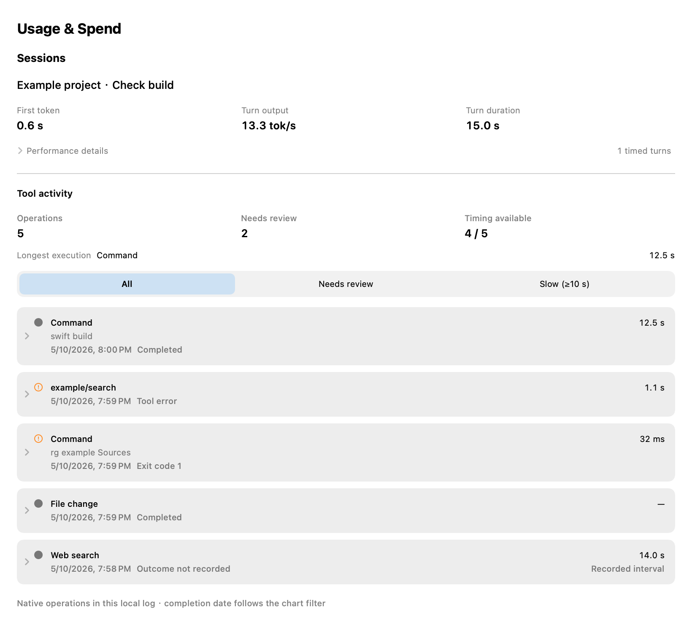
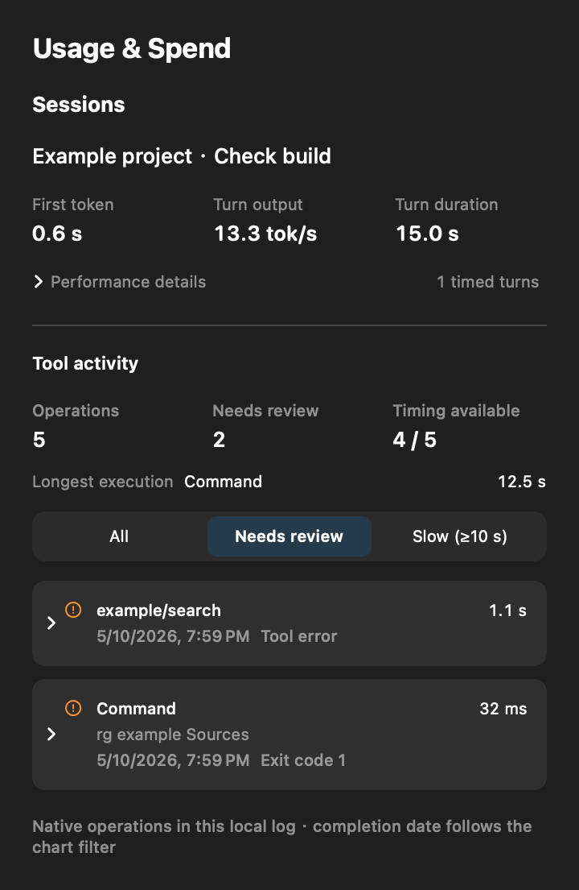

# Native session tool activity

Usage & Spend can now answer what a native Codex session did, which recorded operations took longer,
and which results need inspection. Each session has a collapsed Tool activity section, an operation
summary, filters for all/review/slow (at least ten seconds), and individually expandable local details.
Commands below one second use milliseconds. A nonzero exit code is distinct from a tool error and does
not classify the user's task as failed.

## Data contract

- The native cost scanner supplies the selected rollout URL and session identity. Other providers and
  OpenCodex sources do not expose this section. No global home discovery occurs in the view.
- Only native `event_msg/item_completed` operations are indexed: command execution, MCP, dynamic tools,
  file changes, web search, image operations, and extensions. Model orchestration calls are not added.
- Explicit thread ownership is required. Identity is `(thread, turn, item)`; later observations update
  the same operation. Foreign copied history is excluded. Unassignable native operations mark coverage
  partial rather than being guessed into the current session.
- Root completion timestamps follow the chart's calendar and selected date; row dates and times use
  the chart's time zone, so operations on different days remain distinguishable. Native seconds/nanoseconds
  are preferred. Valid start/end intervals are labeled separately; they do not enter the longest native
  execution comparison. Missing timing is unavailable, distinct from a recorded zero. No task wall time
  is calculated by summing parallel operations. Extension `durationMs` is not assumed to be measured
  execution time (for example, sleep can record a requested duration).
- An MCP error, explicit failure, declined operation, and unknown outcome remain distinct. Neither a
  missing result nor a search command's nonzero exit code is turned into a failed task.

## Performance and privacy

Indexing is on demand on an actor, with cancellation checkpoints every 64 KiB. A streaming projection
skips arguments, result content, file diffs, and unknown values structurally, even when timing fields
follow multi-megabyte output. Metadata projection is capped at 128 KiB, retained strings at 8 KiB,
nesting at 64, a scan at 256 MiB, and operations at 20,000. Incomplete tails, malformed records, missing
native identities/timestamps, and reached limits produce a partial-coverage notice.

At most four source snapshots and 20,000 operations in total are cached only in memory. Unchanged files
reuse the cache; changed files are rescanned conservatively. This version does not claim an incremental
append index. File identity,
size and modification date are checked before/after reads; stale byte offsets are rejected. There is
no tool activity work in routine billing refreshes and no new persistent database or dependency.

The scanner's optional session-source descriptor changes the generated parser fingerprint but does
not change stored billing rows. Databases from current main (`0d8f9504f8e63d0f`) and the stable
0.73.0 release (`7ff985e81e281a11`) are adopted in place through the existing compatible-predecessor
mechanism. Retained history, saved pricing, previous reports and scan checkpoints must survive.

Each operation retains a short command preview and record position. Input/result bodies are read only
when the user expands that operation, bounded to a 4 MiB record and shortened display text. Larger
records expose a clearly labeled raw record preview. Hide personal info suppresses names/previews and
disables body reads. Existing spend JSON exports do not include rollout paths or tool bodies. No
credentials, provider calls, tracing configuration, or execution of recorded commands is required.

Retained turn/item identities are limited to 256 UTF-8 bytes; oversized identities are excluded and
mark coverage partial. Names and command previews have both character and byte limits. Detail text is
limited to 16,000 characters / 64,000 UTF-8 bytes for inputs and 32,000 characters / 128,000 bytes for
results, whichever is reached first. Large structured results use compact JSON to limit indentation
growth. UTF-8 prefixes end on valid scalar boundaries; shortened detail text is explicitly marked.

Detail presentation is keyed by the operation and source file identity, size and modification date.
An older body's display is suppressed immediately when the key changes, before the next asynchronous
load starts. Superseded reads cannot replace a newer result or error state. Collapsed and privacy-hidden
details release their bodies; cancelled reads do not publish a changed-file warning. Refreshing retains
the expanded list and operation disclosure states while showing a loading indicator, then replaces
their results with the current indexed records.

The section deliberately describes operations in the selected local log, not a guaranteed whole-session
history. Older clients may have no native operation records. Cross-session rankings/trends, full call
trees, retry inference, billing attribution, and other-provider support are outside this first version.
English, Simplified Chinese, Traditional Chinese and Italian copy is supplied; other catalogs explicitly carry
English fallback strings pending translation.

## Synthetic UI examples

These production SwiftUI renders use entirely fictitious session names, commands, timing and token
samples. They illustrate the expanded content; the session's Tool activity section starts collapsed.
They are separate from native app interaction checks and contain no personal log data.

## Validation

Focused production parser/dashboard tests cover native ownership, repeated terminal updates, large
escaped command output, nested MCP image content, namespaces, explicit errors and declines, missing
outcomes, invalid timing, native-vs-interval precedence, malformed and unfinished records, rewritten
files, stale details, cancellation, bounded projection, provider isolation, and calendar filtering.
The production SwiftUI content is rendered in English/Chinese, light/dark, 360/820 point widths and all
three filters. These renders are separate from fresh-bundle interaction checks.

An optimized standalone executable compiled the production metadata/index sources and existing
production timestamp helper against authorized local log copies. Counts, timing coverage, and review
outcomes matched the independent structure audit, with no dropped records in that sample. Private
receipts, operation counts, timings, and paths stay in the ignored local proof directory. These
measurements are from one machine with available filesystem cache and do not establish cold-disk
timings, whole-app memory use, or coverage across all historical formats.

## Native runtime and upgrade evidence

[Native interaction transcript](fixtures/spend-tool-activity-native-transcript.json) is a redacted
derivative of actual macOS accessibility observations from the packaged app, reading a byte-for-byte
frozen copy of an existing native Codex session. No synthetic operations were added to that input.
The app has an isolated bundle identifier and test profile, with account refresh and Keychain access
disabled. The production dashboard, scanner, tool index, detail reader and privacy switch are used.

The transcript records five successful checks: discover the real session, expand a command and compare
its input/result with the source, compare MCP input/result JSON with the source, enable Hide personal
info and inspect the masked details, then disable it and inspect the restored details. Private paths,
identifiers, commands, arguments, results, dates, durations, operation counts, usage and cost are
omitted or consistently aliased. Complete originals remain local. The artifact identifies the code
revision, production Sources tree and packaged executable hash; later documentation changes do not
alter that Sources tree. Early automation attempts that failed to reach the expected state are excluded.
These short checks do not establish long-term stability or cover every native client schema.

[Store upgrade regression receipt](fixtures/spend-tool-activity-upgrade-proof.json) uses entirely
synthetic billing data. The new preservation test fails against the pre-fix implementation for the
current-main fingerprint and passes after compatibility adoption is added. Both current-main and
stable stores retain typed saved-pricing rows, ledger state and checkpoints across two opens after
the original log is removed, with unchanged database identity and zero rebuilds. Existing regressions
also cover previous report payloads, unfinished-line resume state and zero session-head reparses.

## Stability validation

[Stability receipt](fixtures/spend-tool-activity-stability-proof.json) binds the final packaged code
and Sources tree to 248 focused tests, the complete 1,625-selection regression and 41 successful
native interaction checks (21 distinct scenarios). Actual window checks include 25 same-identity
result updates while expanded, 100 collapse/expand cycles, 25 refreshes during those cycles, five
privacy on/off rounds and 15 settings close/reopen cycles. Fixtures are entirely fictitious.

The final full regression passed all 45 groups without retries, failures or timeouts. Short post-test
idle sampling returned to 0% CPU, and no new isolated-app crash reports were found. This is evidence
for the exercised paths on one machine, not a long-term leak or schema-compatibility guarantee.
A host disk-capacity interruption and initial harness selector assumptions are recorded separately
in the receipt; incomplete attempts are excluded from the successful counts. The five real-session
checks in the redacted transcript were also rerun against the same packaged code and original input.
