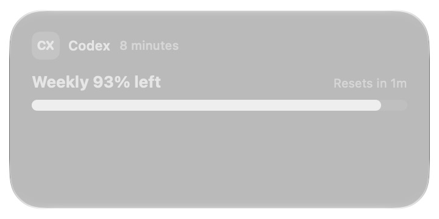

# Installed WidgetKit age/layout proof and reset failure

This exercises the desktop WidgetKit extension, not ImageRenderer or an in-process SwiftUI preview.
The installed medium **Switcher** uses synthetic Codex data: 93% weekly remaining, an age source
290 seconds before its fixed anchor, and reset 110 seconds after that anchor.

## Captured behavior

**Status:** Age advancement and the right-aligned medium headline are demonstrated.
Compact reset advancement is not: accessibility and pixels disagree. This is a failing runtime
experiment, not a claim that the reset implementation is ready.

All timestamps below are UTC on 2026-10-08. The macOS log prints local time (UTC+03:00).

| Capture | Saved age (AX and pixels) | Reset AX | Reset pixels |
| --- | --- | --- | --- |
| 08:30:33 | 5 minutes | Resets in 1m | Resets in 1m |
| 08:31:42 | 6 minutes | Resets in 0m | Resets in 1m |
| 08:32:39 | 7 minutes | Resets in 0m | Resets in 1m |
| 08:34:03 | 8 minutes | Resets in 0m | Resets in 1m |

The reset was 08:32:12. The final frame is more than a minute after expiration; the countdown
reports zero in accessibility, while rendered pixels remain at `1m`. Formatter unit tests
correctly produce zero; they do not establish visual updates in the out-of-process renderer.

The [timeline log](widget-runtime-proof/components-failure-timeline.log) records initialization requests at
08:30:22 and 08:30:26, each containing a single entry. No provider invocation occurs between
08:30:33 and 08:34:03. The earliest requested refresh was 08:35:22, after every capture.
[Raw accessibility captures](widget-runtime-proof/components-failure-frames.json) identify the installed extension
and its accessibility text. The screenshots independently establish that the reset appears at the
right edge, but also reveal its frozen pixels. Accessibility text is not treated as pixel proof.

## Fixture boundary and reproduction

The five production rendering files changed by this PR were copied byte-for-byte into the
fixture extension. [SHA-256 checks](widget-runtime-proof/components-failure-build-record.json) record that identity.
The test copy changes the snapshot input and adds timeline logging; it does not change those
views or date formatters. [The complete fixture diff](widget-runtime-proof/fixture.diff) also
shows a fixed Usage configuration used while setting up the fixture. The captured desktop
widget is Switcher and retains its production static configuration and refresh schedule.

Build the tracked Xcode extension with Xcode 27.0, Debug arm64, applying the fixture diff to
an isolated source copy. Use bundle ID `com.steipete.codexbar.debug.widget`, set the local
Swift package reference to this checkout, and sign the extension and a minimal containing
app locally. Add its medium Switcher to the desktop. Request one reload from that app, then
leave the widget alone for four minutes. Read only the fixture logger subsystem
`com.brzvsk.widget-proof`, and capture the Notification Center widget window at the times above.
Account fetching, snapshot filesystem access, AppIntent configuration, and macOS 14 fallback
are outside this proof. No real account data is used.

## Regression found by this test

The previous PR head `eec1b89b611ac9ab57f6ea3eaf59937d46270d92` used a custom
`WidgetResetFormatStyle`. [The real WidgetKit archive error](widget-runtime-proof/prior-head-archive-failure.log)
shows that Notification Center could not resolve that extension-defined type and displayed a
placeholder. The first repair uses Foundation's system components format with a live date range, but
this installed experiment shows that its visible countdown still freezes.
It also gives the reset label a finite width and trailing text alignment so WidgetKit chooses
the horizontal headline when it fits. Synthetic previews had missed the archive, sizing, and visible countdown problems.

A subsequent isolated trial removed the interpolated prefix and displayed the components
range directly; its accessibility text still advanced while its pixels froze. A system
`DateReference` trial with day/hour/minute fields did visibly advance, but writes units as words
rather than the requested compact `5d 23h`. That trial is not the production source in this PR.
The author subsequently accepted the working native format with units written as words.
The repaired current-source proof is documented in [Installed minute-reference proof](widget-runtime-proof.md).
