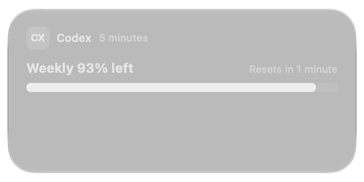
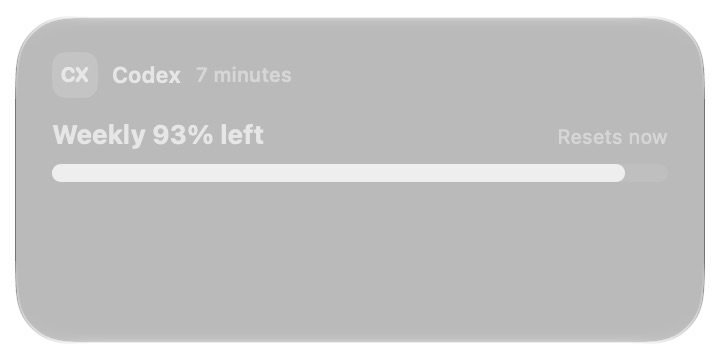

# Installed WidgetKit minute-reference proof

This exercises the desktop WidgetKit extension with the current production rendering sources,
not ImageRenderer or an in-process SwiftUI preview. The installed medium **Switcher** uses a
synthetic fixed Codex snapshot: 93% weekly remaining, age source 290 seconds before its anchor,
and reset 110 seconds after that anchor. The author accepted native units written as words.

## Captured behavior

All timestamps below are UTC on 2026-10-08. The macOS log prints local time (UTC+03:00).
Each row was checked against both screenshot pixels and raw accessibility text; they agree.

| Capture | Age (pixels and AX) | Reset (pixels and AX) |
| --- | --- | --- |
| 09:06:50 | 5 minutes | Resets in 1 minute |
| 09:08:27 | 7 minutes | Resets now |
| 09:09:13 | 7 minutes | Resets 1 minute ago |
| 09:10:42 | 9 minutes | Resets 3 minutes ago |

The reset was 09:08:01. The native reference changes through expiration and identifies the
elapsed reset afterward; it does not claim a future reset or freeze a compact countdown.
Seconds never appear. The reset stays at the right of the headline, above the quota bar.

The [timeline log](widget-runtime-proof/timeline.log) records initialization at 09:06:11,
09:06:29, and 09:06:39, each with one entry. No provider invocation occurs between the first
and last capture. The earliest requested refresh is 09:11:11, after every capture.
[Raw accessibility captures](widget-runtime-proof/frames.json) identify the installed debug
extension; they supplement the independent pixel evidence rather than replacing it.

## Fixture boundary and reproduction

The five production rendering files changed by this PR were copied byte-for-byte into the
fixture extension. [SHA-256 checks](widget-runtime-proof/build-record.json) record that identity.
[The fixture diff](widget-runtime-proof/fixture.diff) changes snapshot input and adds timeline
logging; those views and date formatters are unchanged. A fixed Usage configuration in the
setup copy is outside the captured path. The desktop Switcher retains its production static
configuration and refresh schedule.

Build the tracked Xcode extension with Xcode 27.0, Debug arm64, applying the fixture diff to
an isolated source copy. Use bundle ID `com.steipete.codexbar.debug.widget`, point its local
Swift package reference to this checkout, and sign the extension and a minimal containing app
locally. Add its medium Switcher to the desktop. Request one reload from the app, then leave
it alone for four minutes. Capture the Notification Center widget window and read only the
fixture logger subsystem `com.brzvsk.widget-proof`.

Account fetching, snapshot filesystem access, AppIntent configuration, macOS 14 fallback, and
installed small-family behavior are outside this proof. No real account data is used.

## Regressions exposed by installed testing

The custom formatter at `eec1b89b611ac9ab57f6ea3eaf59937d46270d92` could not be decoded by
Notification Center ([archive error](widget-runtime-proof/prior-head-archive-failure.log)).
A Foundation components range then produced changing accessibility text but frozen reset pixels;
[that failed experiment](widget-runtime-failed-components.md) is retained explicitly as a failure.
The current repair uses the system `DateReference` on the current date, with second fields
excluded. The installed captures above verify its actual visible updates.

A finite-width, trailing-aligned reset label also fixes the medium headline choosing its stacked
fallback in the real host. Narrow layouts retain the stacked fallback. Synthetic previews had
missed these host-specific problems and are not claimed as installed runtime proof.
